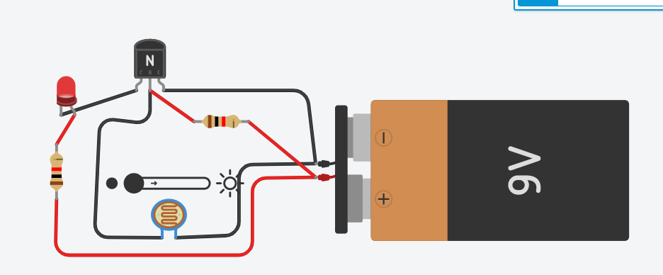
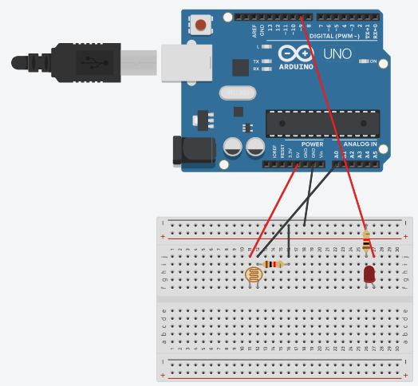
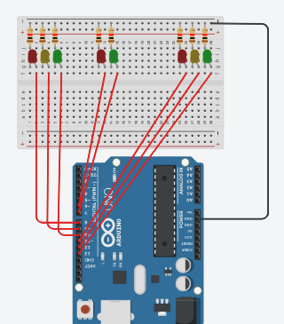
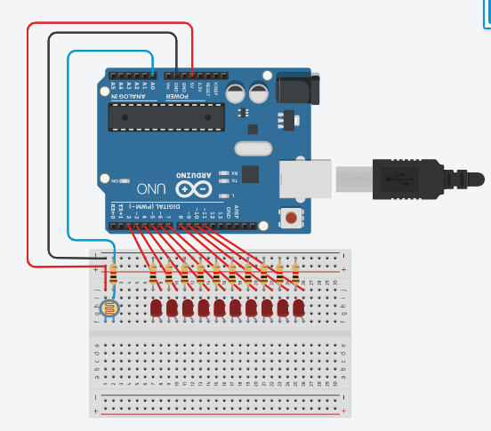
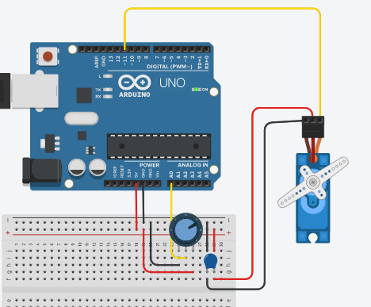
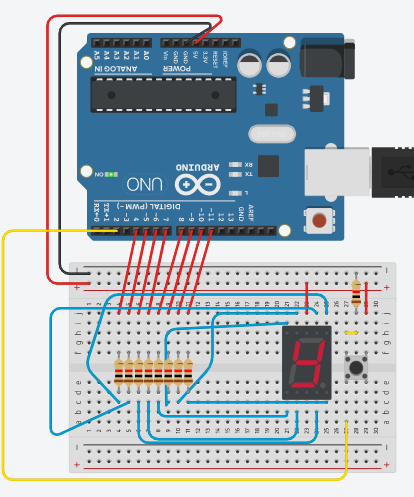
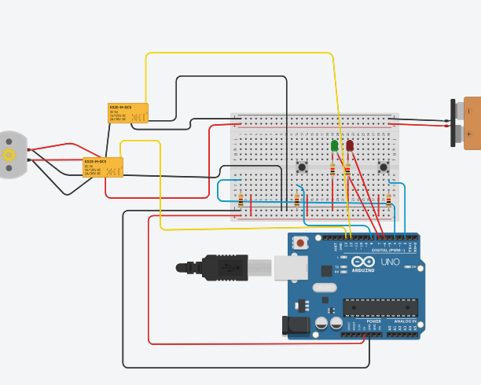

# 🔌 Experimentos de Arduino - IOT

Este repositório reúne os experimentos e desafios desenvolvidos durante as aulas de IOT.

Durante as atividades foram utilizados diferentes componentes eletrônicos para desenvolver circuitos envolvendo iluminação automática, sensores, semáforos, motores, displays e automação de portões.

---

## AULA 02

### Poste com LED e Fotoresistor

Neste experimento foi desenvolvido um poste de iluminação utilizando
um LED e um fotoresistor (LDR), simulando o funcionamento de uma
iluminação pública automática.

O experimento foi realizado em duas versões diferentes **com** ou **sem arduino**.

## Sem arduino

O circuito utiliza apenas os componentes eletrônicos para fazer o controle
da iluminação.

**Circuito:**



## Com Arduino

O Arduino lê a luminosidade pelo fotoresistor e controla o LED, acendendo ou apagando conforme o nível de luz.

**Circuito:**



**Código:**

```cpp
int sensorLuminosidade = A0;
int led = 9;

void setup() {
  pinMode(led, OUTPUT);
}

void loop() {
  int nivelDeLuz = analogRead(sensorLuminosidade);

  nivelDeLuz = map(nivelDeLuz, 0, 900, 255, 0);
  nivelDeLuz = constrain(nivelDeLuz, 0, 255);

  analogWrite(led, nivelDeLuz);
}
---

### AULA 03

## Semáforo de duas vias e pedestre com Arduino

Neste experimento foi desenvolvido um sistema de semáforo utilizando Arduino, simulando duas vias de trânsito e um semáforo para pedestres.

Os dois semáforos funcionam de forma alternada. Enquanto uma via está com o sinal verde, a outra permanece no vermelho. Após o sinal amarelo, o sistema muda a preferência para a outra via.

O semáforo de pedestres também é alterado de acordo com o funcionamento das vias.

**Circuito:**



**Código:**

```cpp
const int vermelho1 = 8;
const int amarelo1 = 9;
const int verde1 = 10;

const int vermelho2 = 11;
const int amarelo2 = 12;
const int verde2 = 13;

const int vermelhoPedestre = 5;
const int verdePedestre = 6;

void setup() {
  pinMode(vermelho1, OUTPUT);
  pinMode(amarelo1, OUTPUT);
  pinMode(verde1, OUTPUT);

  pinMode(vermelho2, OUTPUT);
  pinMode(amarelo2, OUTPUT);
  pinMode(verde2, OUTPUT);

  pinMode(vermelhoPedestre, OUTPUT);
  pinMode(verdePedestre, OUTPUT);

  digitalWrite(vermelho1, HIGH);
  digitalWrite(amarelo1, LOW);
  digitalWrite(verde1, LOW);

  digitalWrite(vermelho2, HIGH);
  digitalWrite(amarelo2, LOW);
  digitalWrite(verde2, LOW);

  digitalWrite(vermelhoPedestre, HIGH);
  digitalWrite(verdePedestre, LOW);

  delay(3000);
}

void loop() {

  digitalWrite(vermelho1, LOW);
  digitalWrite(amarelo1, LOW);
  digitalWrite(verde1, HIGH);

  digitalWrite(vermelho2, HIGH);
  digitalWrite(amarelo2, LOW);
  digitalWrite(verde2, LOW);

  digitalWrite(vermelhoPedestre, HIGH);
  digitalWrite(verdePedestre, LOW);

  delay(2500);

  digitalWrite(vermelho1, LOW);
  digitalWrite(amarelo1, HIGH);
  digitalWrite(verde1, LOW);

  digitalWrite(vermelho2, HIGH);
  digitalWrite(amarelo2, LOW);
  digitalWrite(verde2, LOW);

  digitalWrite(vermelhoPedestre, HIGH);
  digitalWrite(verdePedestre, LOW);

  delay(500);

  digitalWrite(vermelho1, HIGH);
  digitalWrite(amarelo1, LOW);
  digitalWrite(verde1, LOW);

  digitalWrite(vermelho2, HIGH);
  digitalWrite(amarelo2, LOW);
  digitalWrite(verde2, LOW);

  digitalWrite(vermelhoPedestre, LOW);
  digitalWrite(verdePedestre, HIGH);

  delay(3000);

  digitalWrite(vermelho1, HIGH);
  digitalWrite(amarelo1, LOW);
  digitalWrite(verde1, LOW);

  digitalWrite(vermelho2, LOW);
  digitalWrite(amarelo2, LOW);
  digitalWrite(verde2, HIGH);

  digitalWrite(vermelhoPedestre, HIGH);
  digitalWrite(verdePedestre, LOW);

  delay(2500);

  digitalWrite(vermelho1, HIGH);
  digitalWrite(amarelo1, LOW);
  digitalWrite(verde1, LOW);

  digitalWrite(vermelho2, LOW);
  digitalWrite(amarelo2, HIGH);
  digitalWrite(verde2, LOW);

  digitalWrite(vermelhoPedestre, HIGH);
  digitalWrite(verdePedestre, LOW);

  delay(500);

  digitalWrite(vermelho1, HIGH);
  digitalWrite(amarelo1, LOW);
  digitalWrite(verde1, LOW);

  digitalWrite(vermelho2, HIGH);
  digitalWrite(amarelo2, LOW);
  digitalWrite(verde2, LOW);

  digitalWrite(vermelhoPedestre, LOW);
  digitalWrite(verdePedestre, HIGH);

  delay(3000);
}
```

---

### Pista de pouso com LEDs e Arduino

Neste experimento foi criada uma representação de uma pista de pouso utilizando LEDs e um fotoresistor. O Arduino realiza a leitura do fotoresistor e transforma o valor de luminosidade em uma quantidade de LEDs que serão acesos.

Quanto menor a luminosidade, maior é a quantidade de LEDs acesos.

**Circuito:**



**Código:**

```cpp
const int fotoresistor = A0;

int leds[] = {
  2, 3, 4, 5, 6, 7, 8, 9, 10, 11
};

const int quantidadeLeds = 10;

void setup() {
  for (int i = 0; i < quantidadeLeds; i++){
    pinMode(leds[i], OUTPUT);
  }
  
  Serial.begin(9600);
}

void loop() {
  int luminosidade = analogRead(fotoresistor);
  
  int quantidadeAcesos = map(luminosidade, 0, 1023, 10, 0);
  
  for (int i = 0; i < quantidadeLeds; i++){
    if (i < quantidadeAcesos) {
      digitalWrite(leds[i], HIGH);
    } else {
      digitalWrite(leds[i], LOW);
    }
  }
  
  Serial.print("Luminosidade:");
  Serial.print(luminosidade);
  
  Serial.print(" | LEDs acesos: ");
  Serial.print(quantidadeAcesos);
  
  delay(100);
}
```

---

## AULA 04

### Servo motor com potenciômetro, capacitor e Arduino

Neste experimento foi utilizado um potenciômetro para controlar a posição de um servo motor.

O Arduino realiza a leitura do valor analógico do potenciômetro e transforma esse valor em um ângulo entre 0° e 180°.

Assim, ao girar o potenciômetro, o servo motor acompanha a alteração da posição.

**Circuito:**



**Código:**

```cpp
#include <Servo.h>

Servo servo;

int potenc = 0;
int angulo = 0;

void setup(){
  servo.attach(11);
}

void loop() {
  potenc = analogRead(0);
  angulo = map(potenc, 0, 1023, 0, 180);
  servo.write(angulo);
  
  delay(15);
}
```

---

### Display de 7 segmentos

Neste experimento foi utilizado um display de 7 segmentos para representar números de 0 a 9.

Cada segmento do display é controlado individualmente pelo Arduino.

Ao pressionar o botão, o contador é incrementado. Quando chega ao número 9, ele retorna para 0.

**Circuito:**



**Código:**

```cpp
int a = 4;
int b = 5;
int c = 6;
int d = 7;
int e = 8;
int f = 9;
int g = 10;

int botao = 2;
int num = 0;

int entrada[7] = {a, b, c, d, e, f, g};

int display[10][7] = {
  {1, 1, 1, 1, 1, 1, 0},
  {0, 1, 1, 0, 0, 0, 0},
  {1, 1, 0, 1, 1, 0, 1},
  {1, 1, 1, 1, 0, 0, 1},
  {0, 1, 1, 0, 0, 1, 1},
  {1, 0, 1, 1, 0, 1, 1},
  {1, 0, 1, 1, 1, 1, 1},
  {1, 1, 1, 0, 0, 0, 0},
  {1, 1, 1, 1, 1, 1, 1},
  {1, 1, 1, 1, 0, 1, 1}
};

void setup() {

  for (int i = 0; i < 7; i++) {
    pinMode(entrada[i], OUTPUT);
  }

  pinMode(botao, INPUT);

  numero(0);
}

void loop() {

  int click = digitalRead(botao);

  if (click == HIGH) {

    num++;

    if (num >= 10) {
      num = 0;
    }

    numero(num);

    delay(300);
  }
}

void numero(int coluna) {

  for (int i = 0; i < 7; i++) {

    if (display[coluna][i] == 1) {
      digitalWrite(entrada[i], LOW);
    } else {
      digitalWrite(entrada[i], HIGH);
    }
  }
}
```

---

### Desafio do simulador de portão eletrônico

Neste desafio foi desenvolvido um simulador de portão eletrônico utilizando Arduino.

Ao pressionar o botão de controle, o Arduino verifica o estado do portão e aciona o motor na direção necessária.

Os sensores de fim de curso identificam quando o portão chegou completamente aberto ou fechado. Quando um dos sensores é acionado, o motor é desligado.

Os LEDs também são utilizados para indicar o funcionamento do sistema.

**Circuito:**



**Código:**

```cpp
int relePower = 12;
int releDirecao = 13;

int botaoControle = 2;
int fimCursoAberto = 3;
int fimCursoFechado = 4;

bool portaoAberto = false;
bool motorLigado = false;

int ledVermelho = 6;
int ledVerde = 7;

unsigned long tempoAnteriorLed = 0;
const long intervaloLed = 500;
bool estadoLed = false;

void setup() {

  pinMode(relePower, OUTPUT);
  pinMode(releDirecao, OUTPUT);

  pinMode(botaoControle, INPUT);
  pinMode(fimCursoAberto, INPUT);
  pinMode(fimCursoFechado, INPUT);

  pinMode(ledVermelho, OUTPUT);
  pinMode(ledVerde, OUTPUT);
}

void loop() {

  controlarPortao();
  piscarLeds();
}

void controlarPortao() {

  if (digitalRead(botaoControle) == HIGH && !motorLigado) {

    digitalWrite(releDirecao, portaoAberto ? LOW : HIGH);
    digitalWrite(relePower, HIGH);

    motorLigado = true;

    delay(300);
  }

  if (digitalRead(fimCursoAberto) == HIGH) {

    digitalWrite(relePower, LOW);

    motorLigado = false;
    portaoAberto = true;
  }

  if (digitalRead(fimCursoFechado) == HIGH) {

    digitalWrite(relePower, LOW);

    motorLigado = false;
    portaoAberto = false;
  }
}

void piscarLeds() {

  unsigned long agora = millis();

  if (agora - tempoAnteriorLed >= intervaloLed) {

    estadoLed = !estadoLed;

    digitalWrite(ledVermelho, estadoLed);
    digitalWrite(ledVerde, !estadoLed);

    tempoAnteriorLed = agora;
  }
}
```

---

### Dashboard Web

Como continuação do projeto do portão eletrônico, foi desenvolvido um Dashboard Web para analisar os dados de abertura do portão.

O Dashboard foi desenvolvido utilizando : HTML, CSS, JavaScript e dados do arquivo `dados.csv`

O Dashboard mostra dados por meio de gráficos, podendo vizualizar a atividade do portão em varios periodos.

E o projeto esta pronto para ser publicado atraves do GithubPages.

### Sobre

Neste desafio, foi desenvolvido um Dashboard Web para analisar o histórico de aberturas do portão eletrônico durante o mês de maio de 2026. Os dados foram obtidos pelo arquivo dados.csv, contendo data, hora e semana de cada abertura. Com HTML, CSS e JavaScript, foram criados gráficos para mostrar a atividade diária e semanal do portão, facilitando a visualização e análise da movimentação.

**Tecnologias utilizadas:**
- HTML;
- CSS;
- JavaScript;
- Chart.js;
- TinkerCad;
- Arduino Uno
- GithubPAges